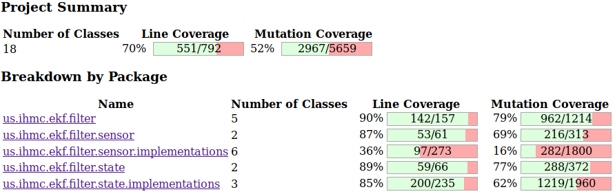
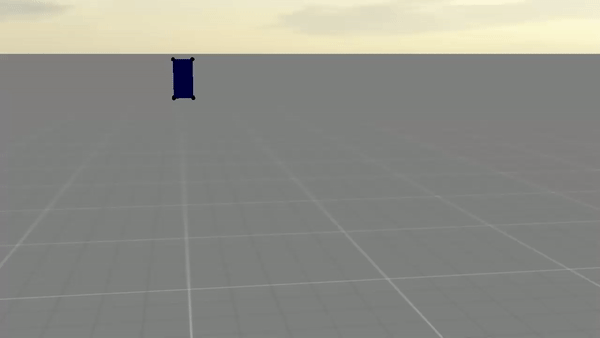

# EKF

This package provides an implementation of an Extended Kalman Filter (EKF) for state estimation in robotics. It depends on the [Mecano](https://stash.ihmc.us/projects/LIBS/repos/mecano/browse) package that provides a rigid-body and multi-body tools to compute Jacobians and other useful quantities related to rigid body systems. The visualization in this package relies on the [Simulation Construction Set](https://stash.ihmc.us/projects/LIBS/repos/simulation-construction-set/browse) package by IHMC.

The test coverage for the package `us.ihmc.ekf.filter`

## Using the Framework

### From Jar with Gradle

To use the release of this package add the following to your gradle dependencies:

`compile group: "us.ihmc", name: "ekf", version: "0.2.8"`

`compile group: "us.ihmc", name: "ekf-test", version: "0.2.8"`

`compile group: "us.ihmc", name: "ekf-visualizers", version: "0.2.8"`

Note, that usually you will only need the main dependency. The others will provide you with tests and some example simulations.

### From Source

To compile and run the code you need Gradle ([instructions](https://ihmcrobotics.github.io/ihmc-open-robotics-software/docs/installgradle)) and Java ([instructions](https://ihmcrobotics.github.io/ihmc-open-robotics-software/docs/installjava)) installed on your system. Install your favorite IDE and import this repository as a gradle project. Gradle will download the dependencies. Now you can run one of the example simulations such as `SimpleArmSimulation`, `FlyingBoxSimulation`, or `FixedBaseArmSimulation`. As the robot moves the estimated robot state is visualizes as a ghost. You may also observe and plot state variables and compare them to the real values.

The gif shows the flying box simulation. It is a simple robot containing only an IMU and a single 6DoF floating joint. At the beginning of the video the estimator is initialized to the true state of the box. You can see that the estimate (blue ghost) starts to diverge from the robot after some time.

## Structure of the Framework

### Kalman Filter
This framework considers angular velocity and accelerations as part of the state. This allows to integrate multiple distributed IMUs seamlessly. The filter also does not treat the matter of estimating the joint states differently from the robot pose. Rather it can use distributed IMU sensors to estimate joint states in case of very noise or faulty joint position sensing.

A good introductory paper for Kalman filters can be found [here](https://www.cs.unc.edu/~welch/media/pdf/kalman_intro.pdf).

### Supported Sensors

 - Joint Position (e.g. Encoders)
 - Linear Body Velocity (e.g. Fixed Points, Cameras)
 - Angular Body Velocity (e.g. IMU Sensors)
 - Linear Body Acceleration (e.g. IMU Sensors)
 - Heading (e.g. Magnetometer in IMU Sensors)
 
### Supported States

 - Revolute Joint
 - Floating Joint
 - Sensor Bias State

## License

Copyright 2018 Florida Institute for Human and Machine Cognition (IHMC)

Licensed under the Apache License, Version 2.0 (the "License");
you may not use this file except in compliance with the License.
You may obtain a copy of the License at

    http://www.apache.org/licenses/LICENSE-2.0

Unless required by applicable law or agreed to in writing, software
distributed under the License is distributed on an "AS IS" BASIS,
WITHOUT WARRANTIES OR CONDITIONS OF ANY KIND, either express or implied.
See the License for the specific language governing permissions and
limitations under the License.

## Compiling Native Code

To speed up the estimation the filter uses some native c++ code to perform the EKF specific matrix operations faster using Eigen. If it becomes necessary to modify / recompile these libraries follow the instructions here.

### Ubuntu

To compile the c++ library on Ubuntu (assuming you are inside the ekf repository folder):

`cd nativeEKF`
`mkdir build`
`cd build`
`cmake ..`
`make`

The dependencies for compiling are
 - Java
 - Eigen3

### Windows

This tutorial assumes a fresh Windows 10 install and was tested in a virtual machine.

Install [Visual Studio 2017 Community](https://visualstudio.microsoft.com/downloads/) and in the installer select "Desktop development with C++".

Install [Java](https://www.oracle.com/technetwork/java/javase/downloads/jdk8-downloads-2133151.html), then open the Advanced System Settings and
select the button "Environment Variables...". In the new Window create a new System variable `JAVA_HOME` and select the jdk directory e.g.
`C:\Program Files\Java\jdk1.8.0_191`.

Download [Eigen](http://eigen.tuxfamily.org/index.php?title=Main_Page#Download) and extract the folder. Rename the folder containing the sub-folder
"cmake" and move it to `C:\Program Files`. Inside the folder (next to the folder "cmake" and others) create a folder "build".
Run the "x64 Native Tools Command Prompt for VS 2017" and navigate into the build folder you created. The run the command `cmake ..`. This will
configure Eigen so it can be found later and can be used to link against.

Finally, in the project folder create a directory called "build". Run the "x64 Native Tools Command Prompt for VS 2017" to compile the project and
navigate into the build folder you created.
Then run the command `cmake -G "Visual Studio 15 2017 Win64" ..` followed by `cmake --build . --target install --config Release`.

### Changing the Native Code API (Ubuntu instructions only)

If you need to modify or extend the functionality of the native libraries and you need to modify the java class `NativeFilterMatrixOpsWrapper` you will need to regenerate the header file by running the command

`javac -h nativeEKF/ src/main/java/us/ihmc/ekf/filter/NativeFilterMatrixOpsWrapper.java`

Then modify the c++ source file to reflect your changes and recompile.
